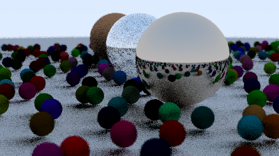

# Margarine Raytracer

A small path tracer written in [Margarine](https://github.com/todaymare/margarine), a Rust-inspired language.



This follows the [Ray Tracing in One Weekend](https://raytracing.github.io/books/RayTracingInOneWeekend.html) tutorial, including diffuse, metal, and dielectric materials, depth of field, and antialiasing.

## Requirements

- Margarine compiler **0.1.0**

Install Margarine from the [Margarine compiler repository](https://github.com/todaymare/margarine).

## Run

From this directory:

```sh
margarine run main.mar
```

The renderer writes the image to `out.ppm`.
